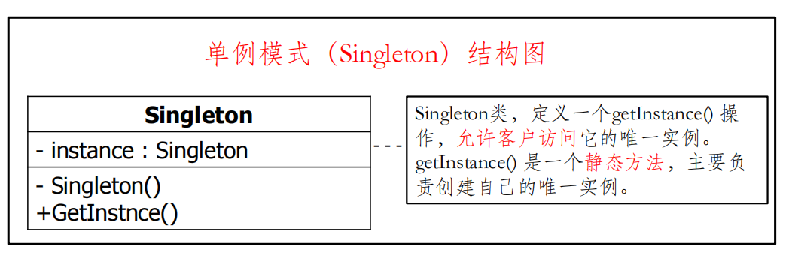
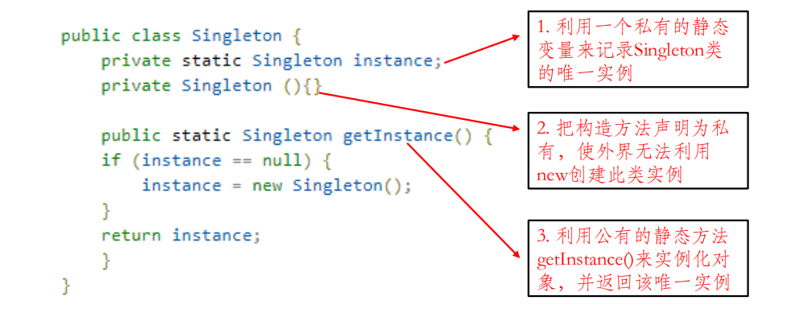
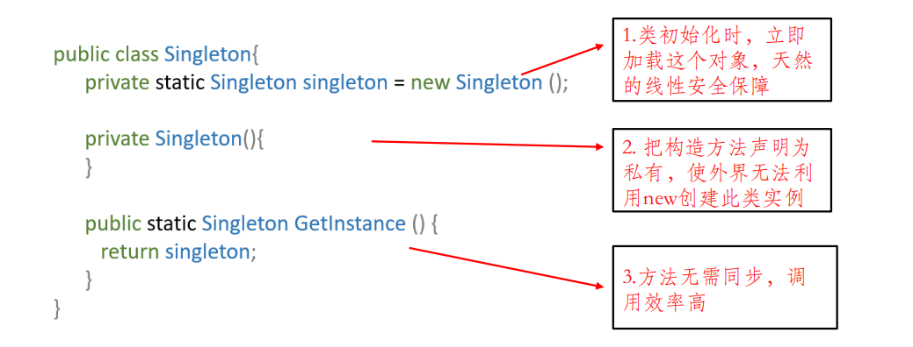
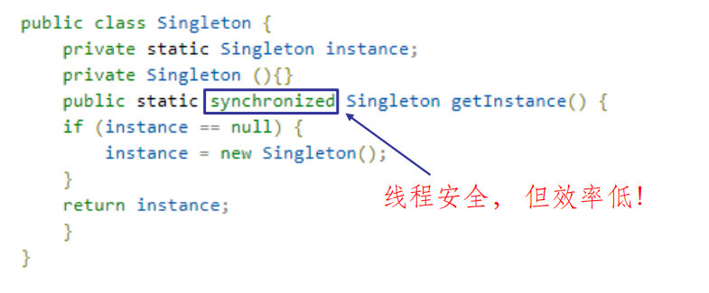
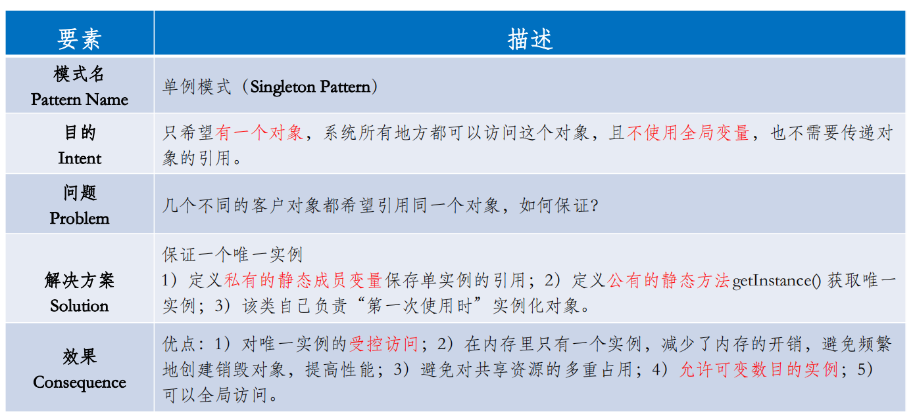

# 单例模式
### <mark style="background-color:orange;">主要内容</mark>
属于创建型的设计模式

保证一个类仅有一个实例，并提供一个访问它的全局访问点。

### <mark style="background-color:orange;">代码例子</mark>
解决的问题:

很多时候我们都要保证一个类只有一个实例

#### 懒汉式:

#### 饿汉式:

#### 懒汉式+同步锁:

#### 测试代码:
无

### <mark style="background-color:orange;">总结</mark>
