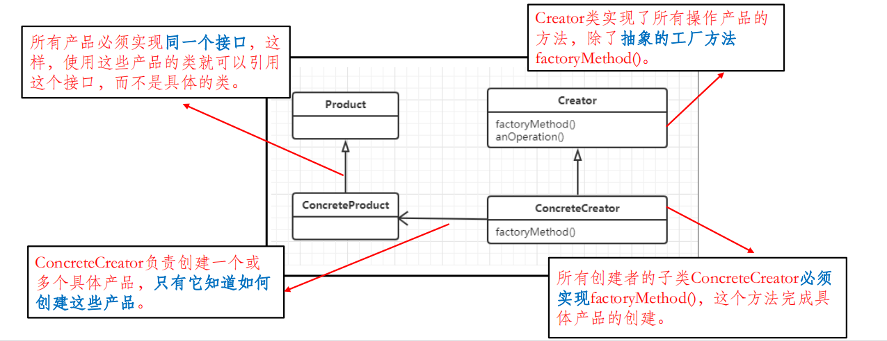
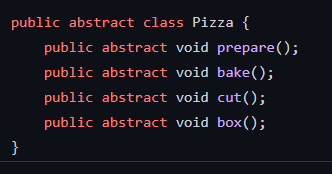
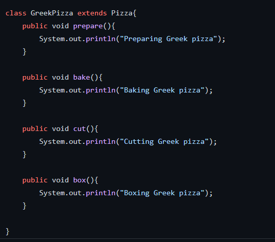
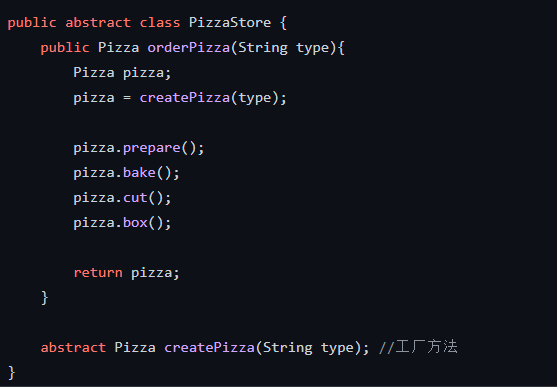
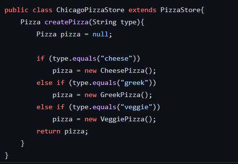
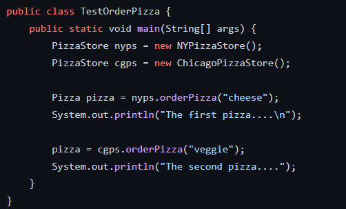

# 工厂模式
### <mark style="background-color:orange;">主要内容</mark>
属于创建型的设计模式

### <mark style="background-color:orange;">代码例子</mark>
模拟一个可以卖出不同口味的pizza店，比萨店经营有成，接下来的计划就是在多个不同城市开设加盟店

需要建立一个框架，把PizzaStore和创建Pizza捆绑在一起， 同时又保持
一定的弹性。

#### pizza(为抽象类):

#### pizza的各个子类:

#### 工厂(抽象):

#### 具体工厂:

#### 测试代码:

### <mark style="background-color:orange;">总结</mark>

1. 通过扩展来新增具体类的，符合开闭原则，但是在客户端就必须要感知到具体的工厂类，
也就是将判断逻辑由简单工厂的工厂类挪到客户端。
2. 工厂模式横向扩展很方便，假如又有新区域的加盟店，那么只需要创建相应的披萨店子
类和披萨子类去实现抽象工厂接口和抽象产品接口即可，而不用去修改原有已经存在的代码。