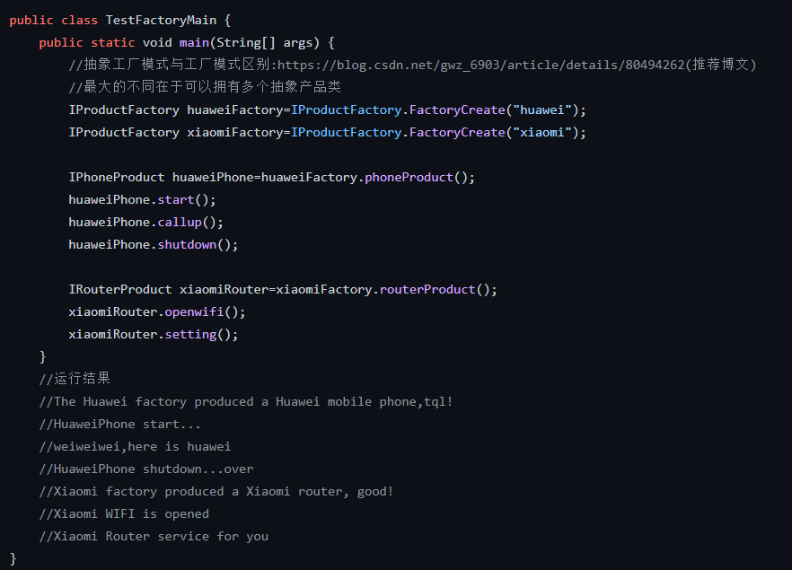

# 抽象工厂模式
### <mark style="background-color:orange;">主要内容</mark>
属于创建型的设计模式

### <mark style="background-color:orange;">代码例子</mark>
模拟各大厂商不同品牌产品的加工，其中一种产品称为产品等级(如手机)，一个产生不同的产品等级的厂商为产品族

#### 手机:

#### 手机实现类:

#### 路由器

#### 路由器实现类:

#### 厂商(抽象))

#### 厂商:

#### 测试代码:

### <mark style="background-color:orange;">总结</mark>

