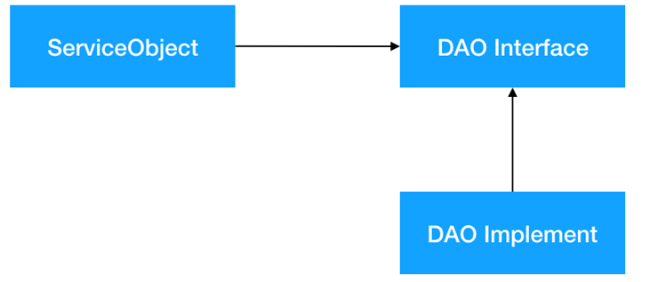

# 数据访问对象模式

简称DAO，该模式不是GOF23种模式之一。

重点在于把**数据访问的操作与业务分离**，实现对**数据库等资源的各种操作**。常用的数据操作比如增删查改都可以放在DAO层。

包含**3个参与者**：数据访问对象接口、数据访问对象实体类、模型对象/数值对象。

<mark style="background-color:orange;">**数据访问对象接口：**</mark>该接口定义了在一个模型对象上要执行的标准操作。

<mark style="background-color:orange;">**数据访问对象实体类：**</mark>该类实现了上述的接口，负责从数据源获取数据，数据源可以是数据库，也可以是 xml，或者是其他的存储机制。

<mark style="background-color:orange;">**模型对象/数值对象：**</mark>该对象是简单的普通对象，包含了 get/set 方法来存储通过使用 DAO 类检索到的数据。

### 数据访问对象模式总结

.png)
