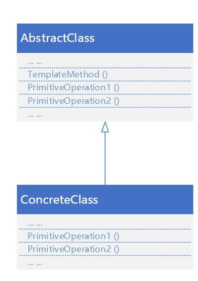
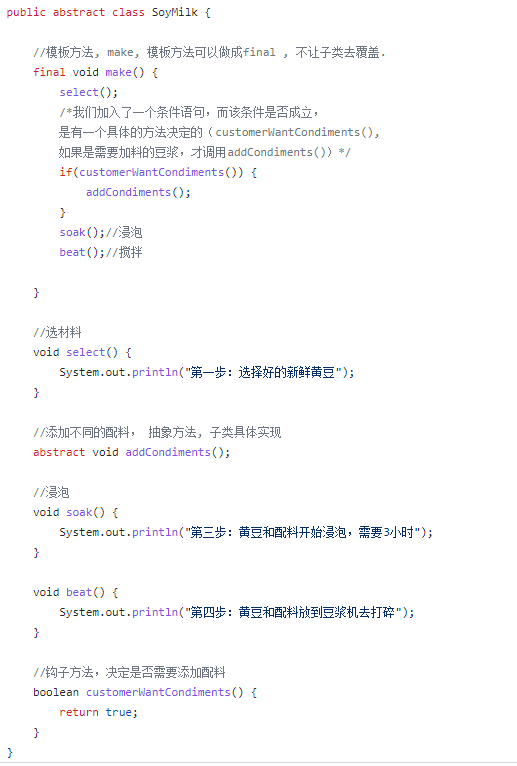
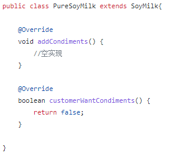
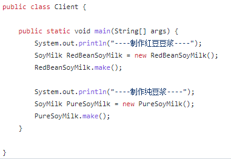

# 模板模式
### <mark style="background-color:orange;">主要内容</mark>
行为型设计模式

### <mark style="background-color:orange;">代码例子</mark>
用模板方法实现红豆奶茶制作

#### 模板类(抽象):

#### 实现的模板:

#### 测试代码:

### <mark style="background-color:orange;">总结</mark>
模板方法导致一种反向控制结构

指的是父类调用一个子类的操作，而不是相反

有时被称为“好莱坞法则”，即“别找我们。我们找你”
