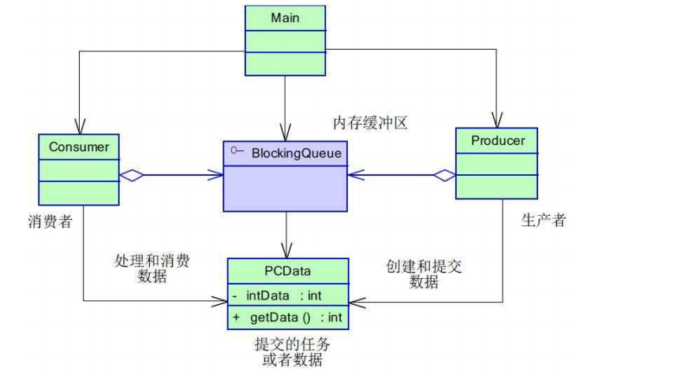

# 生产者消费者模式
### <mark style="background-color:orange;">主要内容</mark>
不属于GOF设计模式

### <mark style="background-color:orange;">代码例子</mark>

#### 缓冲区:

#### 生产者:

#### 消费者:

#### 测试代码:

### <mark style="background-color:orange;">总结</mark>

