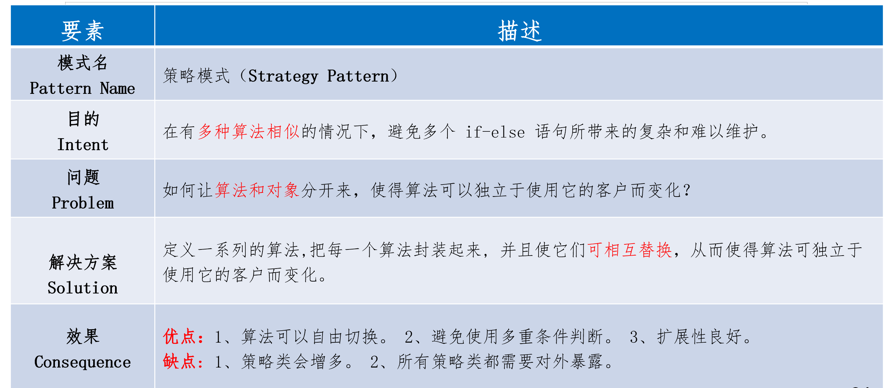

# 策略模式

### <mark style="background-color:orange;">主要内容</mark>

属于行为型的设计模式。

重点对**策略进行抽象**，策略之间**互相独立**，可以互相替换，使得算法与客户分开。主要由是<mark style="color:red;">**3个参与者**</mark>：抽象策略类（策略接口）、具体策略类、环境类（策略使用类）。

.png)

### 代码例子

下面举一个例子，我们想要实现超市销售商品的价格计算函数。对不同类型的用户价格的计算方式不一样。

算法一：对初级会员没有折扣。&#x20;

算法二：对中级会员提供10％的促销折扣。

&#x20;算法三：对高级会员提供20％的促销折扣。

#### <mark style="background-color:orange;">**我们首先设计抽象策略：**</mark>

```
package strategy;
public interface MemberStrategy {
    /**     * 计算图书的价格     
    * @param booksPrice    图书的原价    
     * @return    计算出打折后的价格     
     */    
     public double calcPrice(double booksPrice);
}
```

#### <mark style="background-color:orange;">**接着实现两个具体策略类：**</mark>

<mark style="background-color:yellow;">实现第一个具体策略类：</mark>

```
package strategy;
public class AdvancedMemberStrategy implements MemberStrategy{    
@Override    
public double calcPrice(double booksPrice) {        
    System.out.println("对于高级会员的折扣为20%");        
    return booksPrice * 0.8;    
}
}
```

实现第二个具体策略类：

```
package strategy;
public class PrimaryMemberStrategy implements MemberStrategy{    
@Override    
public double calcPrice(double booksPrice) {        
    System.out.println("对于初级会员的没有折扣");        
    return booksPrice;    
}
}
```

#### <mark style="background-color:orange;">**最后实现环境类：**</mark>

```
package strategy;
public class Price {    
private MemberStrategy strategy;    
/**     
* 构造函数，传入一个具体的策略对象     
* @param strategy 具体的策略对象     
*/    
public Price(MemberStrategy strategy){        
    this.strategy = strategy;    
}    
/**     
*计算图书的价格     
* @param booksPrice 图书的原价     
* @return 计算出打折后的价格     
*/    
public double quote(double booksPrice){        
    return this.strategy.calcPrice(booksPrice);    
}
}
```

<mark style="background-color:orange;">**测试的代码如下：**</mark>

```
package strategy;
public class Client {    
public static void main(String[] args) {        
//选择并创建需要使用的策略对象        
MemberStrategy strategy = new AdvancedMemberStrategy();        
//创建环境        
Price price = new Price(strategy);        
//计算价格        
double quote = price.quote(300);        
System.out.println("图书的最终价格为：" + quote); 
}
}
```

### 策略模式总结


