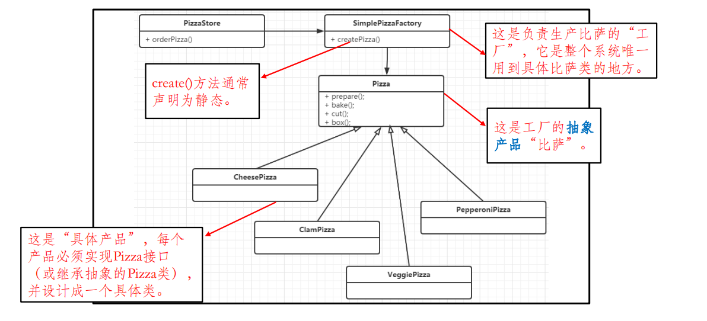
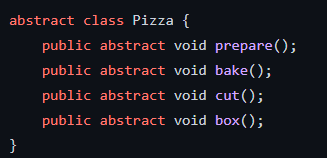
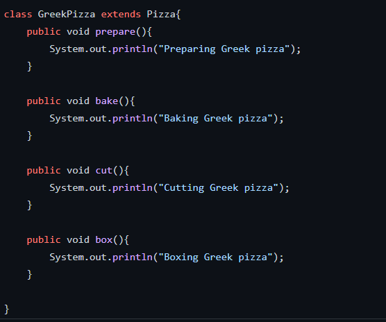
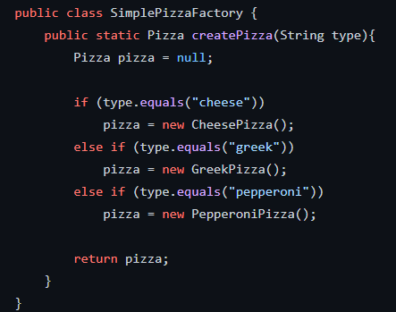

# 简单工厂模式
### <mark style="background-color:orange;">主要内容</mark>
属于创建型的设计模式

简单工厂模式 (SimpleFactory Pattern) 并不是一个真正意义上设计模式，但工
厂模式是建立在它之上。

### 代码例子
模拟一个可以卖出不同口味的pizza店

#### pizza的父类(为抽象类):

#### pizza的各个子类:

#### 工厂:

#### 测试代码:

### 总结:

创建对象的逻辑判断放在了工厂类中，客户不感知具体的类，但是其违背了开闭原则，
如果要增加新的披萨类型，就必须修改工厂类。