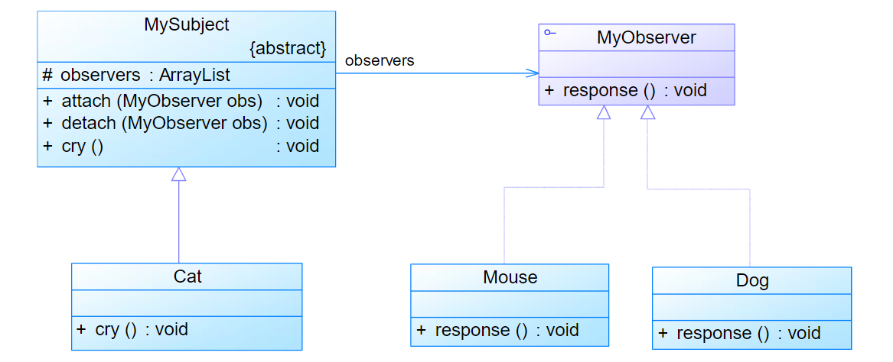
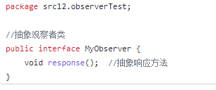
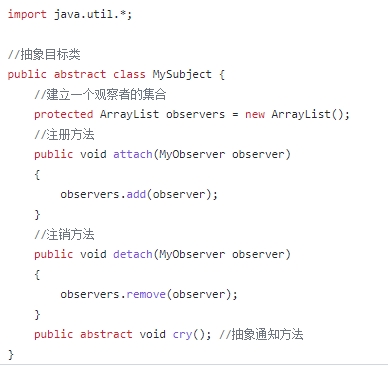
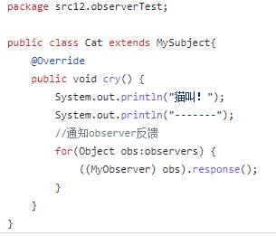
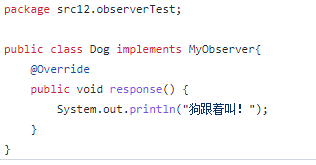
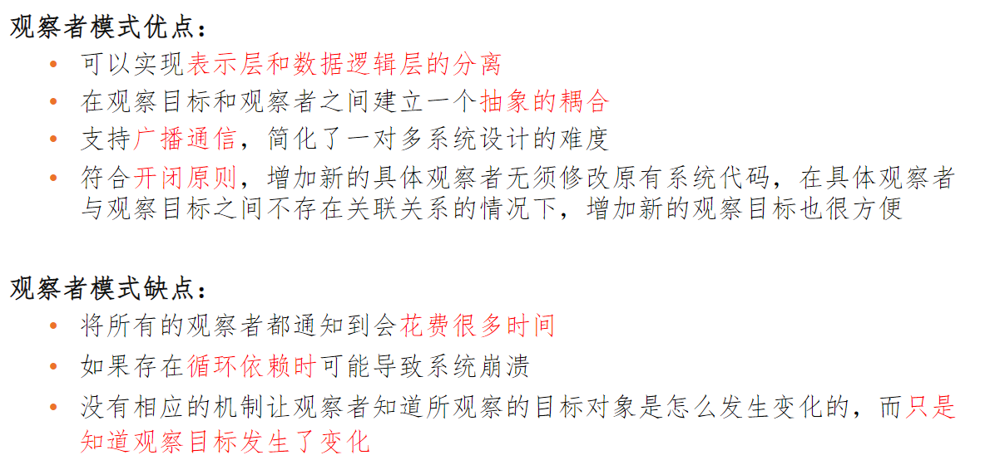

# 观察者模式
### <mark style="background-color:orange;">主要内容</mark>
行为型设计模式

### <mark style="background-color:orange;">代码例子</mark>
假设猫是老鼠和狗的观察目标，老鼠和狗是观察者，猫叫老鼠跑，狗也
跟着叫，使用观察者模式描述该过程。

#### 观察者(抽象):

#### 被观察者(抽象):

#### 猫:

#### 狗子:

#### 老鼠:

#### 测试代码:

### <mark style="background-color:orange;">总结</mark>
